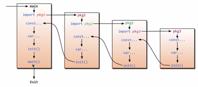

# GoTutorial
## Go的优势
### 极简单的部署方法
- 可直接编译成机器码
- 不依赖其他库
- 直接运行即可部署

### 静态类型语言
- 编译的时候检查出来隐藏的大多数问题

### 语言层面的并发
- 天生的基因支持
- 充分的利用多核

### 强大的标准库
- runtime系统调度机制
- 高效的GC垃圾回收
- 丰富的标准库

### 简单易学
- 25个关键字
- C语言简洁基因，内嵌C语法支持
- 面向对象特征（封装，继承，多态）
- 跨平台

## start1
> https://www.bilibili.com/video/BV1fD4y1m7TD/
1. [main.go](start/main.go)
2. [mars.go](start/mars.go)
3. [guess_game.go](start/guess_game.go)
4. [loop_and_branch.go](start/loop_and_branch.go)
5. [variable_and_scopes.go](start/variable_and_scopes.go)
6. [real_number.go](start/real_number.go)
7. [integer.go](start/integer.go)
8. [large_number.go](start/large_number.go)
9. [text.go](start/text.go)
10. [convert.go](start/convert.go)
11. [function.go](start/function.go)
12. [method.go](start/method.go)
13. [first_order_function1.go](start/first_order_function1.go)
14. [first_order_function2.go](start/first_order_function2.go)
15. [closures_and_anonymous_functions.go](start/closures_and_anonymous_functions.go)
16. [array.go](start/array.go)
17. [slice.go](start/slice.go)
18. [large_slice.go](start/large_slice.go)
19. [map.go](start/map.go)
20. [struct.go](start/struct.go)
21. [composition_and_forwarding.go](start/composition_and_forwarding.go)
22. [Interface.go](start/interface.go)
23. [pointer.go](start/pointer.go)
24. [pointer2.go](start/pointer2.go)
25. [nil.go](start/nil.go)
26. [error_handling.go](start/error_handling.go)
27. [goroutine.go](start/goroutine.go)
28. [channel.go](start/channel.go)
29. [blocking_and_deadlock.go](start/blocking_and_deadlock.go)
30. [concurrency_status.go](start/concurrency_status.go)

## start2
1. [hello.go](start2/hello.go)
2. [test3_const.go](start2/test3_const.go)
3. [test4-function.go](start2/test4-function.go)

4. [test4-function.go](start2/test4-function.go)
5. [5-init](start2/5-init)
6. [6-pointer](start2/6-pointer)
7. [7-defer](start2/7-defer)

